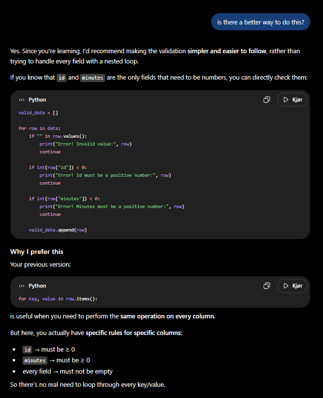
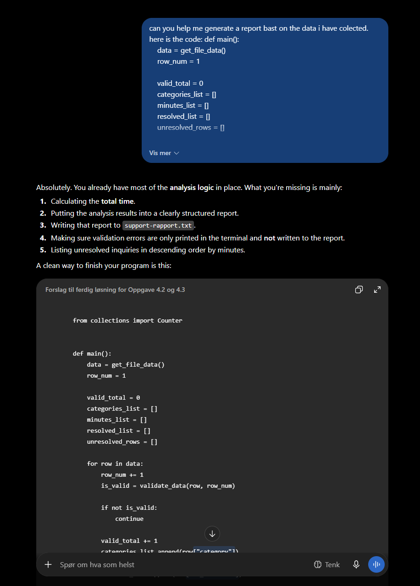
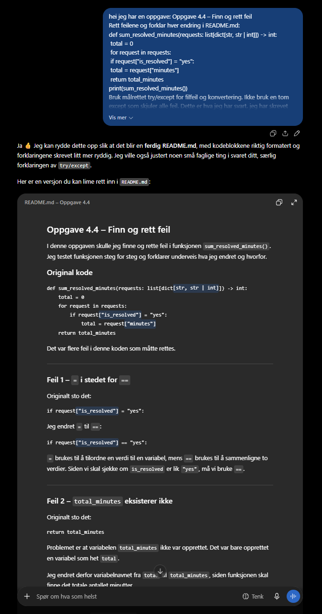

# Bruken av AI

## Oppgave 1:

Ingen bruk av AI her.

## Oppgave 2:

Her bruker jeg AI for å generere dummy data. Dette er fordi det tar mye kortere tid og energi, samt resultatet blir mere som virkelig data.

Her bruker jeg AI for å lage meg en mal da jeg ble usikker å hvor komplisert oppgaven skulle være.

## Oppgave 3:

Ingen bruk av AI her.

## Oppgave 4:

Sleit med å finne ut av hvordan jeg skulle sjekke gjennom hver rad i dataen, så jeg prøvde å kode self først men fikk mye problemer jeg var usikre på hvordan jeg skulle løse. Så derfor brukte jeg AI her for å se om det var en annen måte å gjøre det på. Tok inspirasjon av dette og laget min egen versjon.

Her brukte jeg AI til å generere en mal for raporten. Dette gjorde jeg da jeg var usikker på hvordan jeg skulle formatere det, og ved å bruke AI så tar det mye kortere tid og blir formatert på en ordentlig måte.

Her på oppgave 4.4 bruker jeg AI til å formattere svaret mitt på riktig måte. Jeg har allerede løst og endret i kodeblokken selv, og hadde bare skrevet ned mye kommentarer i koden med en kort forklaring til meg selv. Ved å bruke AI her så blir formateringen av oppgaven profesjonell uten at AI løser selve oppgaven. Kunne ikke bare klippe og lime her da AI ikke kom opp med riktig formatering somt "##" for overskrift og "`blokk`" for blokker og slikt.

## Oppgave 5:

Brukte AI her til å gi meg en bedre forståelse av oppgaven og hva jeg skulle gjøre.

Brukte også AI til å gjøre om stikkord jeg hadde i readme til tekst for dokumenteringen. Liker å bruke stikkord for å skrive ned ting da jeg får mere av det jeg tenker fortere ned på papir og slepper å tenke på at teksten skal være gramatisk riktig, noe jeg kan overlate til AI, som formaterer stikkordene mine til avsnitt som gir mening.
