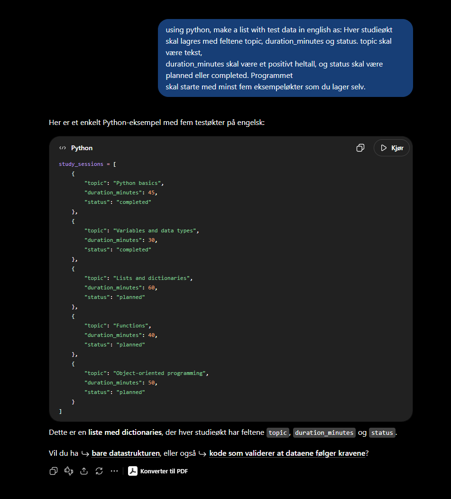
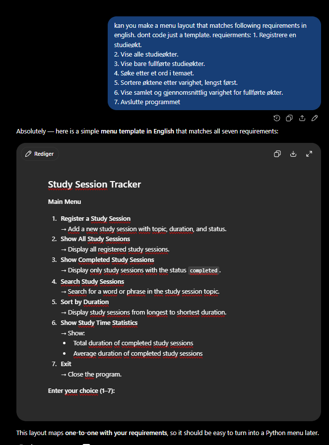

# Bruken av AI

## Oppgave 1:

Ingen bruk av AI her.

## Oppgave 2:

Her bruker jeg AI for å generere dummy data. Dette er fordi det tar mye kortere tid og energi, samt resultatet blir mere som virkelig data.

Her bruker jeg AI for å lage meg en mal da jeg ble usikker å hvor komplisert oppgaven skulle være.

