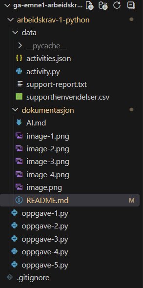

# Gabriel Waade-Eriksen

## Oppgave 2 - Begrunnelse av valgt datastruktur:

Jeg valgte å legge til dataen i en array med flere dictionaries. Dette er fordi denne datastrukturen er en enkel og oversiktlig måte å lagre flere studieøkter på. Listen inneholder alle studieøktene, mens hver dictionary representerer en studieøkt. Dictionary gjør det enkelt å lagre forskjellig informasjon om hver økt, som tema, varighet og status. Det er også enkelt å hente ut, endre og filtrere informasjonen, som for eksempel å finne alle ferdige økter eller legge til en økt. Dette er også en veldig standarisert datastruktur, og er brukt mye i den profersjonelle verden i form av non-sql databaser og json-filer.

## Oppgave 3 - Funksjoner og dokumentasjon:

### Testtilfeller:

| Test | Input                        | Forventet resultat                        | Gyldig/ugyldig |
| ---- | ---------------------------- | ----------------------------------------- | -------------- |
| 1    | `14.09.2026`                 | Datoen godtas                             | Gyldig         |
| 2    | `31.02.2026`                 | Feilmelding og ber brukeren prøve på nytt | Ugyldig        |
| 3    | `13:30`, `90`                | Sluttid blir `15:00`                      | Gyldig         |
| 4    | `13:30`, `-20`               | Feilmelding og ber brukeren prøve på nytt | Ugyldig        |
| 5    | `13:30`, `abc`               | Feilmelding og ber brukeren prøve på nytt | Ugyldig        |
| 6    | `14.09.2026` og `20.09.2026` | Returnerer `6` dager                      | Gyldig         |

### Kilder:

**Tittel:** datetime - Basic date and time types
**Nettadresse:** https://docs.python.org/3/library/datetime.html

## Oppgave 4.4 - Finn og rett feil

### Original kode:

```
def sum_resolved_minutes(requests: list[dict[str, str | int]]) -> int:
    total = 0
    for request in requests:
        if request["is_resolved"] = "yes":
            total = request["minutes"]
    return total_minutes
```

### Feil 1 - `=` i stedet for `==`

Originalt sto det:

```
if request["is_resolved"] = "yes":
```

Jeg endret `=` til `==`:

```
if request["is_resolved"] == "yes":
```

`=` brukes til å tilordne en verdi til en variabel, mens `==` brukes til å sammenligne to verdier. Siden vi skal sjekke om is_resolved er lik "yes", må vi bruke `==`.

### Feil 2 - `total_minutes` eksisterer ikke

Originalt sto det:

```
return total_minutes
```

Problemet er at variabelen `total_minutes` ikke var opprettet. Det var bare opprettet en variabel som het `total`.

Jeg endret derfor variabelnavnet fra `total` til `total_minutes`, siden funksjonen skal finne det totale antallet minutter.

### Første test - `print(total)`

For å finne ut hva verdien i `total` faktisk var, la jeg til:

```
print(total)
```

Da kunne jeg se at verdien var antall minutter for hver enkelt henvendelse.

Koden etter denne endringen var:

```
def sum_resolved_minutes(requests: list[dict[str, str | int]]) -> int:
    total_minutes = 0
    for request in requests:
        if request["is_resolved"] == "yes":
            total = request["minutes"]
            print(total)
    return total_minutes
```

### Endring 2 - bedre variabelnavn

Jeg endret variabelnavnene `requests` og `request` til `inquiries` og `inquiry`.

Jeg endret også `total` til `minutes`, fordi variabelen inneholder antall minutter for én enkelt henvendelse.

Dette gjør koden lettere å forstå:

```
def sum_resolved_minutes(inquiries: list[dict[str, str | int]]) -> int:
    total_minutes = 0
    for inquiry in inquiries:
        if inquiry["is_resolved"] == "yes":
            minutes = inquiry["minutes"]
            print(minutes)
    return total_minutes
```

### Endring 3 – legge sammen minuttene

Jeg oppdaget at koden bare hentet ut minuttene, men ikke la dem sammen.

Jeg endret derfor:

```
print(minutes)
```

til:

```
total_minutes += minutes
```

Dette gjør at minuttene fra hver løste henvendelse blir lagt til `total_minutes`.

Koden ble da:

```
def sum_resolved_minutes(inquiries: list[dict[str, str | int]]) -> int:
    total_minutes = 0
    for inquiry in inquiries:
        if inquiry["is_resolved"] == "yes":
            minutes = inquiry["minutes"]
            total_minutes += minutes
    return total_minutes
```

Dette er den riktige løsningen dersom `minutes` allerede er et heltall.

### Endring 4 - teste beregningen

For å kontrollere at beregningen faktisk ble riktig, lagde jeg midlertidig en variabel som lagret den gamle verdien av `total_minutes`.

Deretter sjekket jeg om:

gammel verdi + minutter = ny verdi

Koden jeg brukte for å teste dette var:

```
def sum_resolved_minutes(inquiries: list[dict[str, str | int]]) -> int:
    total_minutes = 0
    for inquiry in inquiries:
        if inquiry["is_resolved"] == "yes":
            old_total_minutes = total_minutes

            minutes = inquiry["minutes"]
            total_minutes += minutes

            if old_total_minutes + minutes == total_minutes:
                print(f"True: {old_total_minutes} + {minutes} = {total_minutes}")
            else:
                print(f"False: {old_total_minutes} + {minutes} = {total_minutes}")

    return total_minutes
```

Dette var bare en test for å kontrollere at summeringen fungerte. Testkoden trenger ikke være med i den endelige funksjonen.

### Endring 5 - `try/except` og konvertering til `int`

Funksjonen bruker typen:

```
str | int
```

Det betyr at `minutes` kan være enten en streng eller et heltall.

For at vi skal kunne summere verdien på en trygg måte, bruker jeg:

```
minutes = int(inquiry["minutes"])
```

Da blir for eksempel `"60"` gjort om til `60`.

Jeg la også til en målrettet `try/except` rundt konverteringen:

```
try:
    minutes = int(inquiry["minutes"])
    total_minutes += minutes
except (ValueError, TypeError):
    continue
```

`ValueError` kan oppstå dersom verdien ikke kan konverteres til et heltall, for eksempel `"abc"`.

`TypeError` kan oppstå dersom verdien har en type som ikke kan brukes av `int()`.

Jeg bruker ikke en tom `except`, fordi det ville skjult alle typer feil. Her håndterer jeg bare de feilene som kan oppstå ved konverteringen.

### Løsning

```
def sum_resolved_minutes(inquiries: list[dict[str, str | int]]) -> int:
    total_minutes = 0
    for inquiry in inquiries:
        if inquiry["is_resolved"] == "yes":
            try:
                minutes = int(inquiry["minutes"])
                total_minutes += minutes
            except (ValueError, TypeError):
                continue
    return total_minutes
```

## Oppgave 5 - Miniprosjekt: aktivitetsplanlegger

### Om programmet

Activity Planner Pro er et konsollbasert program for å registrere og
administrere aktiviteter.

Programmet lar brukeren:

- registrere aktiviteter
- vise aktiviteter
- søke etter aktiviteter
- filtrere etter status
- sortere etter dato eller varighet
- markere aktiviteter som fullført
- vise statistikk
- lagre aktiviteter til fil
- lese aktiviteter fra fil

Hver aktivitet inneholder følgende informasjon:

- `title` – navnet på aktiviteten
- `category` – kategorien aktiviteten tilhører
- `date` – dato for aktiviteten
- `estimated_minutes` – estimert varighet i minutter
- `status` – enten `planned` eller `completed`

Programmet bruker en enkel `Activity`-klasse og lagrer aktivitetene i en liste mens programmet kjører.

### Hvordan programmet brukes

Hvordan programmet brukes

Programmet startes ved å kjøre `oppgave-5.py`.

Når programmet starter, vises en meny med følgende alternativer:

- [1] Add activity
- [2] Show activities
- [3] Search activities
- [4] Filter activities
- [5] Sort activities
- [6] Complete activity
- [7] Show statistics
- [8] Save activities
- [9] Load activities
- [10] Exit

#### Registrere aktivitet

Ved registrering må brukeren skrive inn:

Tittel
Kategori
Dato i formatet `dd.mm.yyyy`
Estimert varighet i minutter

Brukeren skriver inn nummeret til ønsket handling.

Programmet kontrollerer at tekstfeltene ikke er tomme, at datoen har riktig format, og at varigheten er et positivt heltall.

#### Vise aktiviteter

Alternativ 2 viser alle aktivitetene som er lagret i programmet. For hver aktivitet vises tittel, kategori, dato, estimert varighet og status.

#### Søke etter aktiviteter

Alternativ 3 lar brukeren søke etter aktiviteter ved å skrive inn tekst. Søket sammenlignes med både tittel og kategori.

Søket er ikke avhengig av store og små bokstaver.

#### filtrere aktiviteter

Alternativ 4 lar brukeren filtrere aktivitetene etter status:

- `planned`
- `completed`

#### Sortere aktiviteter

Alternativ 5 lar brukeren sortere aktivitetene etter:

- dato
- varighet

Datoene sorteres kronologisk, mens aktiviteter etter varighet sorteres fra lengst til kortest.

#### Markere aktivitet som fullført

Alternativ 6 viser alle planlagte aktiviteter og lar brukeren velge hvilken aktivitet som skal markeres som fullført.

Når en aktivitet fullføres, endres statusen fra `planned` til `completed`.

#### Vise statistikk

Alternativ 7 viser:

- totalt antall aktiviteter
- samlet estimert tid
- antall fullførte aktiviteter

#### Lagre og lese aktiviteter

Alternativ 8 lagrer aktivitetene i `activities.json`.

Alternativ 9 leser aktivitetene fra JSON-filen og legger dem inn i programmet igjen.

Hvis datafilen ikke finnes, gir programmet en feilmelding i stedet for at programmet stopper.

### Filstruktur



- `oppgave-5.py` - hovedprogrammet, menyen og funksjonene som håndterer aktivitetene.
- `data/activity.py` - inneholder `Activity`-klassen som representerer en aktivitet.
- `data/activities.json` - datafilen som brukes til å lagre aktiviteter.
- `dokumentasjon/README.md` - dokumentasjon av prosjektet.

### Viktige valg

#### `Activity` klassen i en egen fil

Jeg har valgt å ha `Activity` klassen i en egen fil fordi det gjør programmet mer oversiktlig.

Hovedprogrammet inneholder funksjoner og menyen, mens `Activity` klassen har ansvar for selve aktiviteten. Dette gjør det lettere å finne frem i koden og gjør at hovedfilen ikke blir unødvendig stor.

Klassen inneholder attributtene:

- `title`
- `category`
- `date`
- `estimated_minutes`
- `status`

Klassen har også metoden `complete()`, som brukes når en aktivitet skal markeres som fullført.

#### JSON som datafil

Jeg har valgt å bruke JSON som dataformat fordi JSON er et vanlig og enkelt format for lagring av data.

JSON passer også godt til dette prosjektet fordi aktivitetene kan representeres som dictionaries med nøkkel-verdi-par. Flere aktiviteter kan deretter lagres i en liste.

Eksempel på hvordan en aktivitet kan se ut i JSON:

```
{
    "title": "Trening",
    "category": "Helse",
    "date": "24.09.2026",
    "estimated_minutes": 60,
    "status": "planned"
}
```

JSON gjør det også enkelt å lese dataene inn igjen når programmet startes eller brukeren velger å laste inn aktiviteter.

#### `if __name__ == "__main__"`:

Jeg har valgt å bruke:

```
if __name__ == "__main__":
    main()
```

Dette gjør at `main()` bare kjøres automatisk når `oppgave-5.py` kjøres direkte.

Jeg bruker dette fordi programmet har en hovedfunksjon som starter resten av programmet. Det gjør også koden mer ryddig dersom filen senere skulle importeres fra et annet Python-program.

#### Rydde terminalen

Jeg har laget funksjonen `clear_terminal()` som rydder terminalen mellom de forskjellige menyene og handlingene.

Dette gjør programmet mer oversiktlig fordi gammel tekst ikke blir liggende i terminalen. Det gir også programmet en mer applikasjonslignende følelse, selv om det er et konsollprogram.

Funksjonen fungerer på både Windows og andre vanlige operativsystemer:

```
os.system('cls' if os.name == 'nt' else 'clear')
```

### Testing

Jeg har testet programmet med både gyldig og ugyldig input for å kontrollere at funksjonene fungerer som forventet, og at ugyldig input ikke fører til at programmet stopper.

| Test | Input                                              | Forventet resultat                                      | Gyldig/ugyldig |
| ---- | -------------------------------------------------- | ------------------------------------------------------- | -------------- |
| 1    | `Trening`, `Helse`, `14.09.2026`, `60`             | Aktiviteten registreres med status `planned`            | Gyldig         |
| 2    | Tom tittel                                         | Feilmelding og ber brukeren prøve på nytt               | Ugyldig        |
| 3    | `31.02.2026`                                       | Feilmelding og ber brukeren skrive inn dato på nytt     | Ugyldig        |
| 4    | `14.09.2026`                                       | Datoen godtas                                           | Gyldig         |
| 5    | `90`                                               | Varigheten godtas                                       | Gyldig         |
| 6    | `-20`                                              | Feilmelding og ber brukeren prøve på nytt               | Ugyldig        |
| 7    | `abc` som varighet                                 | Feilmelding og ber brukeren skrive inn et tall          | Ugyldig        |
| 8    | Søk etter `trening`                                | Aktiviteter med `trening` i tittel eller kategori vises | Gyldig         |
| 9    | Velger `planned` i filteret                        | Bare planlagte aktiviteter vises                        | Gyldig         |
| 10   | Velger en planlagt aktivitet i "Complete activity" | Aktiviteten får status `completed`                      | Gyldig         |
| 11   | Velger sortering etter dato                        | Aktivitetene vises sortert kronologisk                  | Gyldig         |
| 12   | Velger sortering etter varighet                    | Aktivitetene vises sortert etter varighet               | Gyldig         |
| 13   | Velger `11` i hovedmenyen                          | Feilmelding og brukeren sendes tilbake til menyen       | Ugyldig        |
| 14   | `activities.json` finnes ikke ved lasting          | Feilmelding vises og programmet fortsetter              | Ugyldig        |
| 15   | Lagrer aktiviteter til `activities.json`           | Aktivitetene lagres i JSON-filen                        | Gyldig         |

### Kjente feil

Det er ingen kjente feil som hindrer hovedfunksjonene i programmet fra å fungere.

En liten begrensning er at datafilen må ha riktig JSON-struktur for at programmet skal kunne lese den. Dersom JSON-filen er ødelagt eller inneholder feil data, håndterer ikke programmet alle mulige JSON-feil.

### Mulige forbedringer

Det finnes flere ting som kunne blitt forbedret dersom programmet skulle videreutvikles:

- Håndtere ødelagte eller ugyldige JSON-filer med JSONDecodeError.
- Automatisk laste inn aktivitetene når programmet starter.
- Automatisk lagre aktivitetene når programmet avsluttes.
- Gjøre det mulig å redigere eller slette aktiviteter.
- Gi brukeren mulighet til å sortere varighet både stigende og synkende.
- Validere at datoen ikke ligger i fortiden dersom dette skulle være et krav.
- Forbedre søkefunksjonen med flere søkemuligheter.
